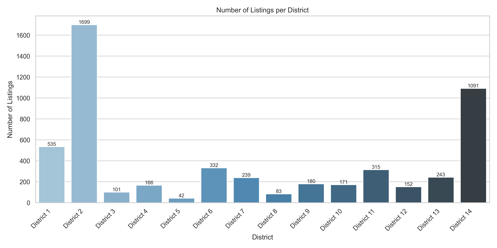
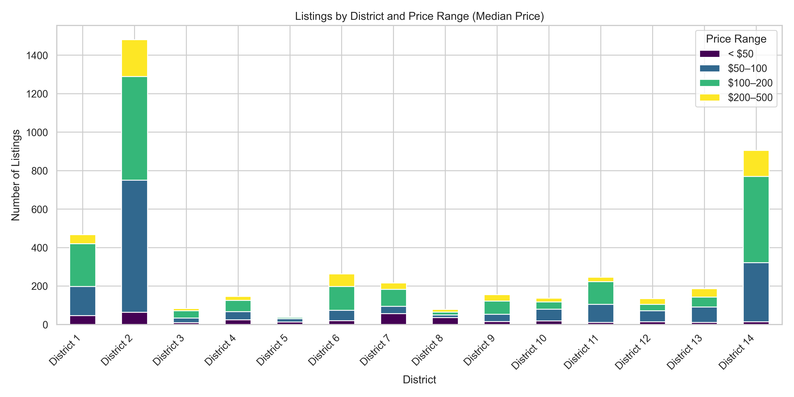
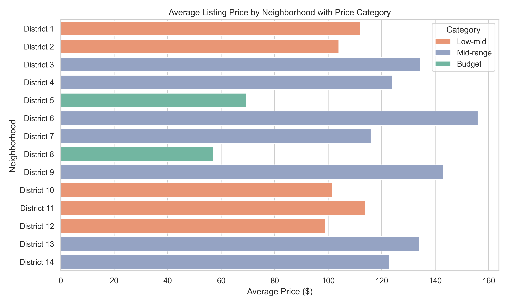
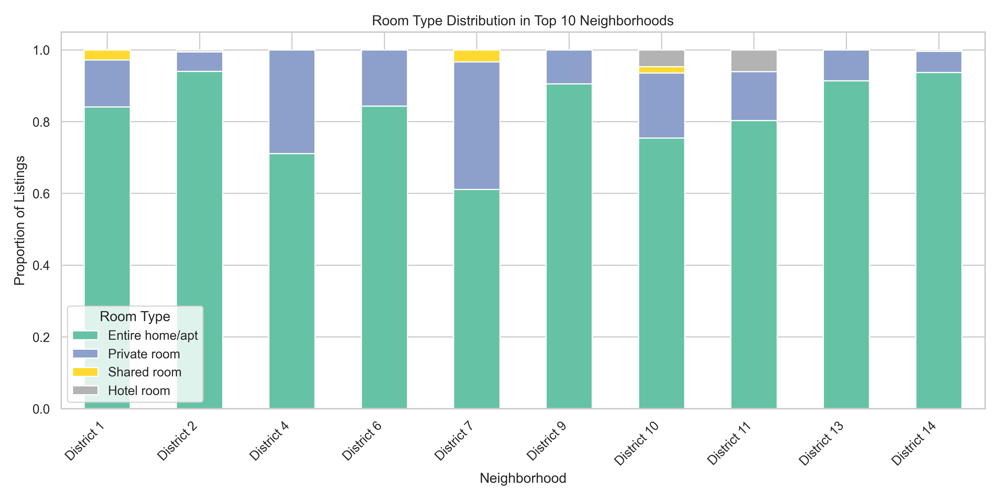
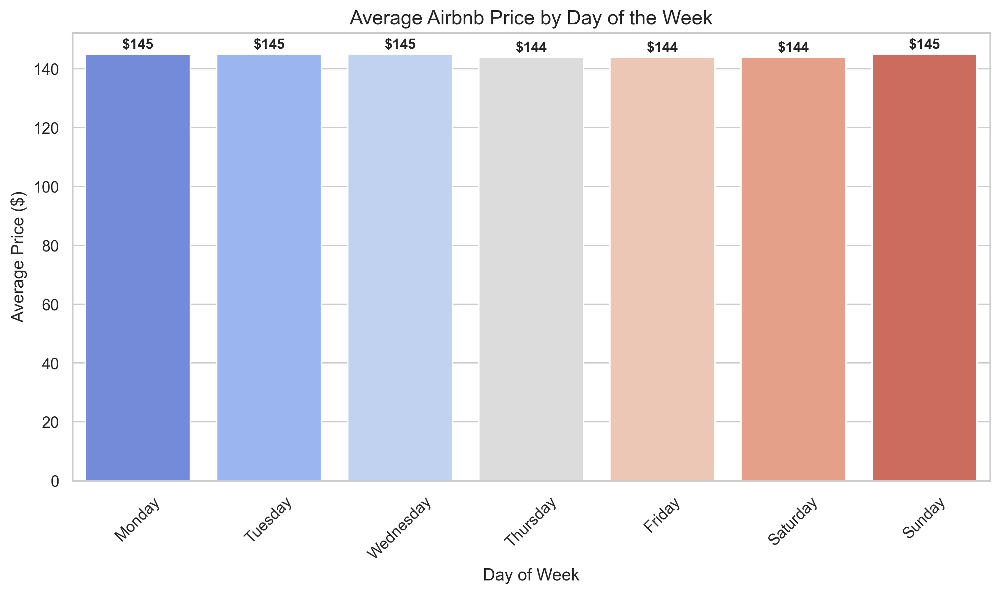
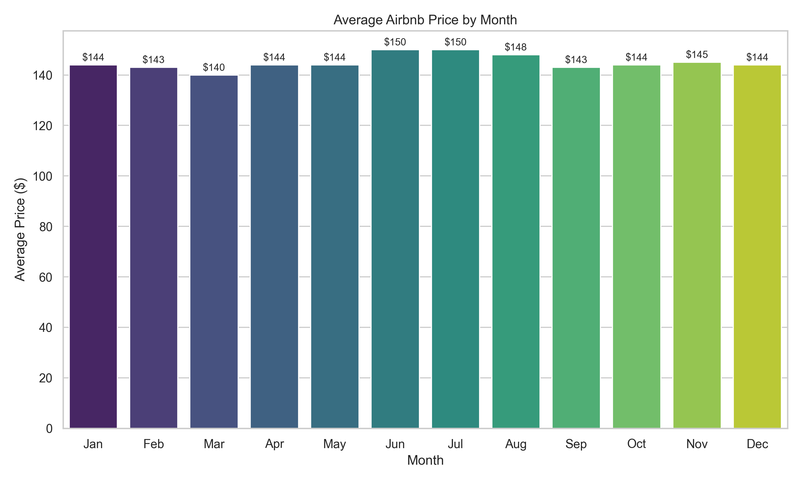

# 🏡 Airbnb Listings Data Analysis

A comprehensive data analytics project exploring Airbnb listings in **Dallas, Texas**. This analysis includes pricing trends, neighborhood segmentation, room type distributions, and seasonal patterns. Designed for portfolio presentation and decision-support for both travelers and hosts.

---

## 📌 Table of Contents
- [Project Overview](#project-overview)
- [Dataset Description](#dataset-description)
- [Research Questions](#research-questions)
- [Key Findings](#key-findings)
- [Tools & Technologies](#tools--technologies)
- [Project Structure](#project-structure)
- [How to Run](#how-to-run)
- [Insights & Visualizations](#insights--visualizations)
- [Author](#author)
- [License](#license)

---

## 📊 Project Overview

This project aims to analyze Airbnb listings data from Inside Airbnb to:
- Understand pricing dynamics across neighborhoods.
- Identify seasonal patterns in listing prices.
- Classify listings into price segments (Budget, Mid-range, Premium).
- Support hosts and travelers with actionable insights.
- Demonstrate practical skills in data wrangling, visualization, and storytelling.

---

## 🗂️ Dataset Description

- **Source**: [Inside Airbnb](http://insideairbnb.com/)
- **City**: Dallas, Texas
- **Columns Used**: `price`, `neighbourhood_cleansed`, `room_type`, `id`, `calendar` `date`
- **Records**: [Number of rows] listings

Outliers were removed using the IQR method to reduce skew and provide clearer pricing insights. Both original and cleaned versions are maintained for comparison.

---

## ❓ Research Questions

1. What is the typical price range of Airbnb listings in the city, and how does it vary by neighborhood?
2. Are there patterns in listing prices by day of the week or month of the year?
3. Which neighborhoods have the highest and lowest concentrations of listings in different price segments?
4. How does removing extreme outliers affect pricing interpretations?
5. What insights can guide Airbnb hosts and guests in decision-making?

---

## 🔍 Key Findings

- **Most Expensive (Median Price)**: District 6
- **Most Budget-Friendly**: District 8 and District 5
- **Price Trends**: Slight increase in summer months (June–July)
- **Room Types**: Entire homes dominate; private rooms common in budget areas
- **Listing Volume**: Districts 2 and 14 have the highest listing counts

---

## ⚙️ Tools & Technologies

- Python
- Jupyter Notebook
- Pandas, NumPy
- Matplotlib, Seaborn
- Markdown
- Git & GitHub

## 🚀 How to Run the Project
bash 
```
git clone https://github.com/Pathogenic-cmd/air_bnb.git
cd air_bnb
```

On mac/Linux:

bash
```
python3 -m venv venv
source venv/bin/activate
```

On Windows:

bash
```
python -m venv venv
venv\Scripts\activate
```
Install dependencies:

bash
```
pip install -r requirements.txt
```

Launch the Jupyter Notebook:

bash
```
jupyter notebook
```

📊 Optional: View as a Web App:
 
bash
```
voila notebook.ipynb
```


## 🧾 Project Structure
- project-root/
- |-- data/
- |   |-- raw_data.csv
- |   |-- cleaned_data.csv
- |-- notebooks/
-  |   |-- notebook
- |-- output/
-  |  |-- cleaned_data
-  |   |-- visualisations
- |-- README.md


## 💡 Insights & Visualizations

- **Districts 2 and 14 have the highest number of listings.**

     

- **Median pricing gives a better sense of neighborhood affordability than the average due to skew from luxury properties.**
- Median vs Average Price (Average Price)
   


- Median vs Average Price (Median Price)
  


- **Budget listings are concentrated in Districts 5 and 8.**

    


- **Room type distribution shows 'Entire home/apt' dominates most districts, but some like District 8 lean more toward 'Private room'.**

    


- **Prices remain relatively stable across days of the week but increase slightly in July and June.**

- Prices by weekday
  

- Monthly Prices
  


## 👤 Author

**Daniel Kofi Debrah Awuma**  
Research Assistant — Religion and Gender 
[LinkedIn](https://www.linkedin.com/in/daniel-awuma-23201b22a) | [GitHub](https://github.com/Pathogenic-cmd)


## 📄 License
**This project is licensed under the [MIT License](LICENSE).**